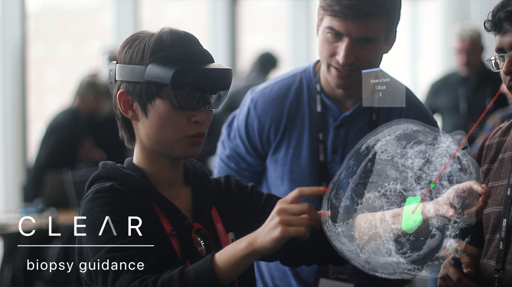
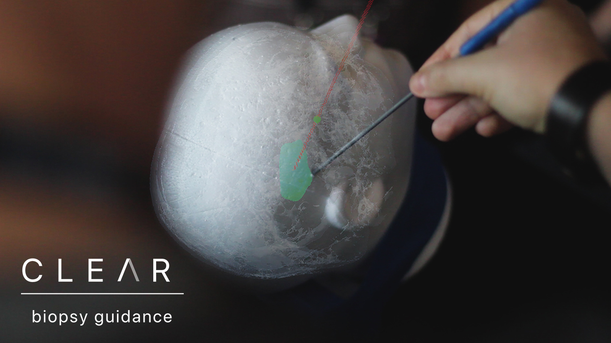

# CLEAR - Augmented Reality Guided Biopsy
## Augmented Reality Surgical Navigation Tool for Microsoft HoloLens 2

We are a team of clinicians, developers and designers dedicated to solving practical challenges in healthcare. The inspiration for the CLEAR Biopsy Guidance System was to use augmented reality to guide neurosurgical brain biopsy procedures. We envisioned a system that could improve patients’ outcomes and safety as well as physicians’ working experience.

**What it does**

Clear – Biopsy Guidance provides an augmented reality environment with the following components:

- Patient Safety: Patient identification and information
- Surgical Planning and Review: Patient-specific radiological imaging and procedure planning information
- AR guided Biopsy: The planned trajectory and radiological imaging for the brain biopsy directly overlayed onto the patient’s head

**How we built it**

Our system was based on the Hololens 2 augmented reality display, using Unity to build the experience. For the imaging components, we used 3d slicer software to convert the 2D data into 3D geometry and Autodesk Maya to re-mesh and delete the outer skull surfaces. The UI development was done in Sketch software. Our application required precise mapping of digital objects and physical instruments. The current state of spatial hand and object tracking was a key challenge that limited the precision of our application. We also initially attempted real-time volume rendering of MRI data, but found the computational requirements to be too substantial for the Hololens 2 system to handle.

**What's next**

We’re primarily proud of how we were able to synthesize multiple fields of expertise into a strong use case-driven approach. Our team brought insight from neurosurgery, medical imaging, real-time rendering, unity and design. We truly enjoyed working together. The case for augmented reality applications in healthcare is strong. Our team is interested in solving the critical issues that will enable AR systems such as ours to reach clinical-grade performance.
